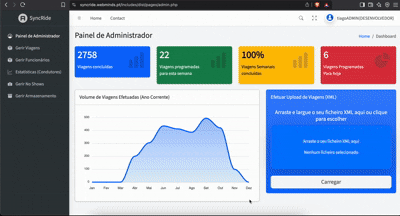

<div align="center">
  
</div>

<h1 align="center">SyncRide - Advanced Ride Management System</h1>

<div align="center">
  
  
  
  
  
  
</div>

> SyncRide is a comprehensive, web-based platform designed for managing transport services such as airport transfers, private drivers, and shuttle operations. It features a robust administrative backend for operations management and a streamlined, mobile-first driver panel for in-field execution.

---

## 🌟 Project Purpose & Value Proposition

SyncRide was born from a direct operational challenge faced by a newly acquired transport company. Upon taking ownership, the new management was confronted with a highly inefficient and archaic workflow for dispatching drivers.

**The original process was manual, error-prone, and extraordinarily time-consuming.** It involved:
1.  Manually opening and parsing raw XML booking files.
2.  Reading trip data line-by-line to understand passenger, location, and time details.
3.  Transcribing this information onto spreadsheets or notepads.
4.  Mentally mapping out dozens of daily trips against driver availability.
5.  Coordinating these assignments individually with each driver.

This logistical bottleneck consumed hours of administrative time *every single day*.

**SyncRide was engineered to be the definitive solution.** It automates this entire operational pipeline, transforming a multi-hour manual data-entry and logistical puzzle into a streamlined process that is now managed with just **a few clicks**.

The system provides an immediate and immense return on time, eliminating human error, centralizing all operations, and liberating management to focus on strategic growth rather than clerical gridlock.

---

## 🚀 Key Features & Visual Showcase

### 1. Administration Panel



* **Central Dashboard:** At-a-glance overview of daily and weekly operational statistics using interactive charts.
* **Ride Management:** Full CRUD (Create, Read, Update, Delete) capabilities for all trips in a filterable `DataTables.js` interface.
* **Driver Assignment:** Assign rides to available drivers directly from the main ride list.
* **Data Import:** A utility to upload and parse XML files, which automatically populates and updates the trip database.
* **User Management:** Complete user administration for creating, editing, and deleting admin and driver accounts.

<br clear="all">
<br>


* **No-Show Management:** A dedicated portal to review all trips flagged as "No-Show". Includes viewing photographic evidence submitted from the field.
* **System Maintenance:** A storage and data management panel with critical functions:
    * **Database Backup:** One-click generation and download of a full SQL database backup.
    * **Data Pruning:** Secure functions to delete all trip records (`Services`) or clear all system action `Logs`.
    * **System Health Monitor:** A dashboard widget that shows the time elapsed since the last system backup.

<br clear="all">

### 2. Driver Panel


* **Mobile-First Interface:** A responsive dashboard designed for on-the-go use by drivers.
* **Trip Manifest:** Displays a clean list of all trips assigned to the logged-in driver.
* **Quick Filters:** "Yesterday," "Today," and "Tomorrow" buttons to easily filter the trip list.
* **Trip Details Modal:** Provides all necessary trip info, including passenger count, client name, and flight number.
* **Waze Integration:** Features one-click buttons to open the Waze app and automatically start navigation to either the pickup point or the final destination.
* **No-Show Reporting:**
    * Allows the driver to report a client no-show directly from the trip details.
    * Activates the device's camera (attempting rear-facing first) for proof.
    * Captures and uploads the photo proof directly to the server via an AJAX request.
    * The modal interface is optimized to auto-scroll to the camera view on mobile devices.

<br clear="all">

---

## 🛠️ Technology Stack

### Backend
* 🐘 **PHP:** Core server-side language. Used for all business logic, session management, and database interaction.
* 🐬 **MySQL (via PDO):** The database backend. All database queries are handled securely using the PDO (PHP Data Objects) extension (see `Auth/dbconfig.php`).

### Frontend
* 📄 **HTML5 & CSS3:** Standard markup and styling.
* ⚡ **JavaScript (ES6+):** Used heavily for client-side interactivity, especially in the Driver Panel.
* 🅱️ **AdminLTE:** The core Bootstrap-based admin template used for the entire UI.
* ⚙️ **jQuery:** Used for simplified DOM manipulation and AJAX calls.
* 🗂️ **DataTables.js:** Powers the interactive, searchable, and paginated tables in the Admin Panel.
* 🔔 **Toastr.js:** Used for clean, non-intrusive success and error notifications.
* 📊 **ApexCharts:** Used to render statistics charts in the admin dashboards.

---

## ⚙️ Installation & Setup

1️⃣  **Clone the repository:**
    ```bash
    git clone [https://github.com/your-username/syncride.git](https://github.com/your-username/syncride.git)
    cd syncride
    ```

2️⃣  **Database Configuration:**
    * Create a new MySQL database (e.g., `syncride`).
    * Import the database schema from a `.sql` file (if provided) or build the tables manually.
    * **Crucially**, ensure your `Services` table contains the `noShowStatus` and `noShowPhotoPath` columns:
        ```sql
        ALTER TABLE Services
        ADD COLUMN noShowStatus TINYINT(1) NOT NULL DEFAULT 0,
        ADD COLUMN noShowPhotoPath VARCHAR(255) DEFAULT NULL;
        ```
    * Configure your database credentials by editing `Auth/dbconfig.php`.

3️⃣  **Set Folder Permissions (Critical Step):**
    * The No-Show upload script requires write permissions on the server to save photos.
    * Ensure the `Includes/dist/pages/uploads/no_shows/` directory exists.
    * Give your web server (e.g., `www-data`, `apache`) write permissions to this folder.
    * On a Linux/macOS server, you can often run:
        ```bash
        # Make sure the 'uploads' and 'no_shows' directories exist
        mkdir -p Includes/dist/pages/uploads/no_shows/
        
        # Grant write permissions to the web server
        # Adjust 'www-data' to your server's user if different
        chown -R www-data:www-data Includes/dist/pages/uploads/
        chmod -R 775 Includes/dist/pages/uploads/
        ```

4️⃣  **Run the Application:**
    * Place the project folder in your server's web root (e.g., `htdocs`).
    * Access the application through your browser (e.g., `http://localhost/syncride/`).
    * The main login page is `index.php`.

---

## 🗺️ Roadmap

Future plans to enhance the SyncRide platform include:

* 🛰️ **Live Driver Tracking:** Re-architecting the Driver Panel as a hybrid mobile app (using Capacitor.js) to enable reliable, background GPS tracking that reports location data to a live map in the admin panel.
* 🔔 **Push Notifications:** Alerting drivers via push notification when a new trip is assigned to them.
* 🧑‍💻 **Client Portal:** A simple interface for clients to check the status of their upcoming ride.
* 🖐️ **Drag-and-Drop Assignment:** A visual interface in the admin panel to drag trips onto a list of available drivers.

## 📄 License

This project is licensed under the MIT License.
