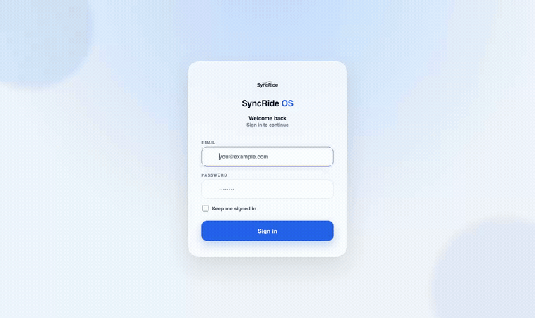
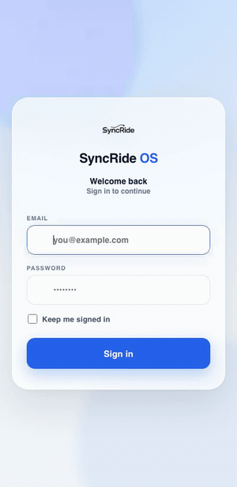
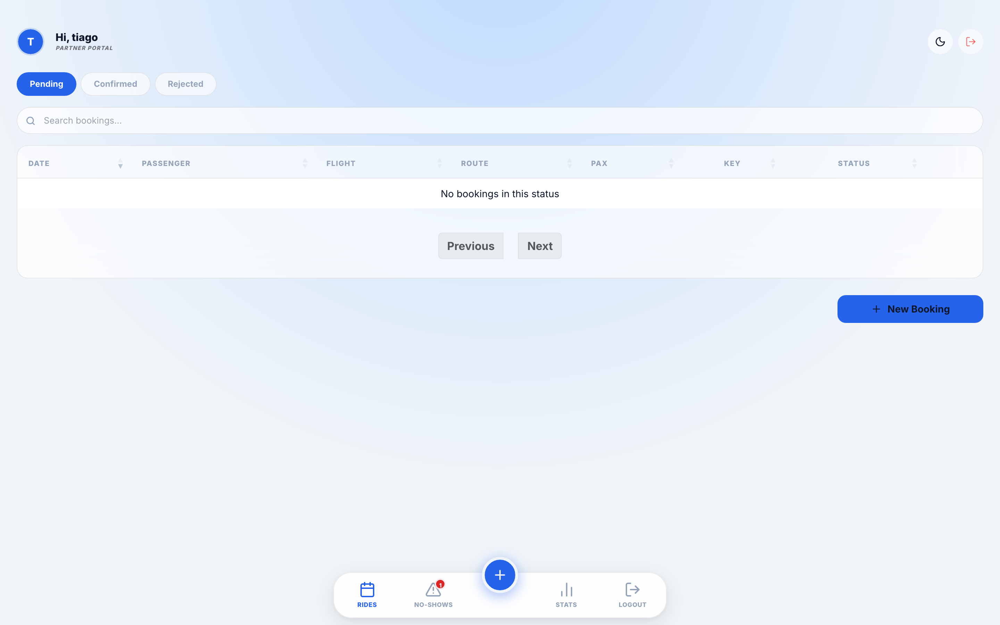

# SyncRide

> **A operação de transfers, automatizada.** As agendas chegam sozinhas ao WhatsApp dos condutores, os clientes seguem a viagem em tempo real e as faturas saem sem ninguém tocar numa folha de cálculo.

[](https://github.com/1231366/SyncRide/actions/workflows/ci.yml)
[](https://www.php.net/)
[](https://www.php-fig.org/psr/psr-4/)
[](https://phpunit.de/)
[]()

SyncRide é uma plataforma **em produção** que gere empresas de transfers de ponta a ponta — viagens, condutores, frota, parceiros e automações. Três experiências, um sistema: o **Gestor** no computador, a **app do Condutor** no telemóvel e o **Portal do Parceiro** para agências e hostels.

---

## 👔 Gestor — controla a operação toda

Painel com viagens de hoje/semana, desempenho e próximas viagens. A lista de viagens filtra por estado e data, atribui condutores e delega serviços a empresas parceiras.


## 📅 Quadro de Agenda — arrastar e largar

Planeamento visual: arrasta viagens por atribuir para o dia e a hora, escolhe o condutor, e alterna entre vista semanal, diária e mensal. Cada condutor tem a sua cor.



## 🚗 Condutor — a agenda no bolso

App pensada para o telemóvel: o condutor vê as viagens do dia, inicia a viagem, e regista no-shows com foto e GPS. Quem trabalha para várias empresas vê a empresa de cada viagem.

<p align="center"></p>

## 🏨 Parceiro — pede e acompanha serviços

Agências e hostels pedem transfers e acompanham o estado de cada viagem e os no-shows — sem terem de telefonar.



---

## ✨ O que resolve

- **Despacho automático** — as agendas seguem para o WhatsApp dos condutores todos os dias, sozinhas
- **Colaboração entre empresas** — delega viagens a parceiros quando tens a mais, com registo de quem é cada uma para acertar contas
- **Condutores partilhados** — o mesmo condutor trabalha para várias empresas, com a agenda separada por empresa
- **Prova de no-show** — foto + GPS guardados e enviados por email automaticamente
- **Faturação e relatórios** — gerados e enviados no fim de cada serviço
- **Onboarding por link** — cria uma vaga, envia o link, a pessoa preenche os próprios dados

📖 **[Manual completo com todos os ecrãs explicados →](public/manual/)**

---

## 🛠️ Para quem quer espreitar o código

<details>
<summary>Stack & arquitetura</summary>

- **PHP 8.2**, sem framework — arquitetura MVC própria (Controllers finos → Repositories → Services → DTOs)
- **PSR-4** autoload, **PDO** com prepared statements em todo o lado
- **Multi-tenant** — cada empresa só vê os seus dados; isolamento via `company_id` em cada query
- **Segurança** — tokens CSRF, ownership guards nas mutações, `bcrypt`, `session_regenerate_id`, escape de output
- **Testes** PHPUnit + **CI** (GitHub Actions: lint + testes em PHP 8.2 e 8.3)
- **`public/`** é a única pasta exposta; tudo o resto fica fora do document root

```
app/          Controllers, Repositories, Services, Models, Support
cron/         Jobs agendados (relatório diário, agenda WhatsApp)
public/       Entry points + assets (a única pasta web-acessível)
resources/    Vistas (PHP templates) + traduções PT/EN
tests/        PHPUnit (Unit)
```

**Correr localmente:**
```bash
composer install
cp .env.example .env   # configurar DB + mail
php -S localhost:8000 -t public
composer test
```

</details>

---

**Autor:** Tiago Silva · [tiagofsilva04@gmail.com](mailto:tiagofsilva04@gmail.com)
