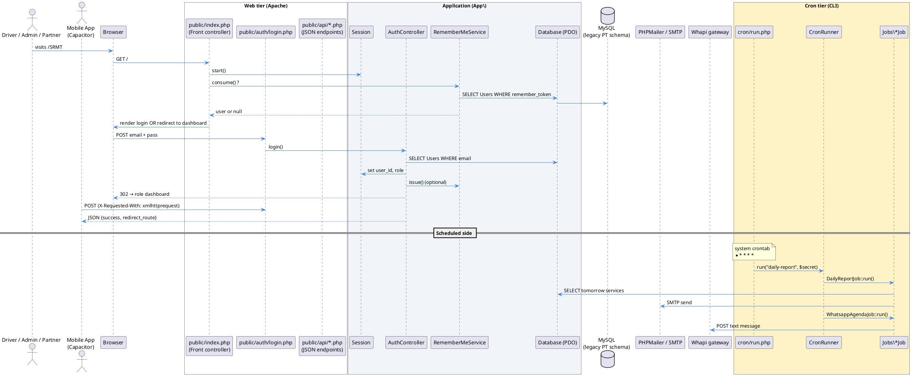
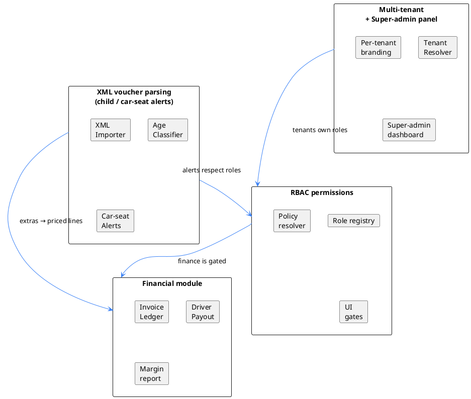

# SyncRide

> **A production fleet & transfer-management platform** — schedules drivers, dispatches services, tracks vehicles in real time, and ships paperwork (vouchers, reports, post-trip emails) without a human in the loop.

[](https://github.com/1231366/SyncRide/actions/workflows/ci.yml)
[](https://www.php.net/)
[](https://www.php-fig.org/psr/psr-4/)
[](https://phpunit.de/)
[]()

---

## Why this repo exists

SyncRide began as a request from a Portuguese transfer operator who outgrew spreadsheet-based dispatching. Over four iterations it became a multi-role web platform that today drives daily operations: assigning rides to drivers, broadcasting tomorrow's agenda via WhatsApp, generating post-trip reports for clients and partner agencies, and feeding an in-house AI assistant that fields questions about fleet performance.

This repository is the **clean-room rewrite of the production codebase**, organised around two principles:

1. **Anything web-facing lives in `/public`.** Application code, configuration, tests, and crons sit outside the document root.
2. **Secrets and environment knobs live in `.env`.** Nothing connects to a database, sends mail, or invokes a third-party API based on a value hard-coded in source.

---

## Tech stack

| Layer            | Choice                                              | Why                                                |
| ---------------- | --------------------------------------------------- | -------------------------------------------------- |
| Language         | PHP 8.2                                             | Match the production runtime                       |
| Autoloading      | PSR-4 via Composer (`App\\`, `Cron\\`, `Tests\\`)   | Industry standard, IDE-friendly                    |
| Database         | MySQL 8 / MariaDB 10 (PDO)                          | Already in production; preserved schema            |
| Testing          | PHPUnit 10                                          | Strict mode, separate Unit / Integration suites    |
| Front-end        | Bootstrap 5, Toastr, vanilla JS                     | Carried over from the existing UI                  |
| Mail             | PHPMailer 6 over SMTP                               | Used by the daily-report and final-trip jobs       |
| Scheduling       | System cron → `cron/run.php` runner                 | One entry-point, gated by `CRON_ENABLED` + secret  |

---

## Project layout

```
syncride/
├── app/                        Application source (PSR-4, App\)
│   ├── Auth/                   AuthController, RememberMeService
│   └── Support/                Env, Database, Session
│
├── cron/                       Scheduled jobs (PSR-4, Cron\)
│   ├── Jobs/                   One class per recurring task
│   ├── Legacy/                 Original scripts bridged by the new jobs
│   ├── CronJob.php             Interface every job implements
│   ├── CronRunner.php          Resolves a job slug → executes it
│   └── run.php                 CLI entry point used by the system crontab
│
├── config/                     Env-driven configuration arrays
│   ├── app.php
│   ├── database.php
│   └── cron.php
│
├── public/                     The only web-accessible folder
│   ├── index.php               Front controller (login + role redirect)
│   ├── auth/                   login.php, logout.php
│   ├── admin/                  32 admin endpoints (index, users, fleet, rides, …)
│   ├── driver/                 Driver dashboard, stats, agenda
│   ├── partner/                Partner dashboard + partner API
│   ├── api/                    Shared JSON endpoints
│   ├── assets/                 CSS, JS, fonts, vendor, images
│   ├── uploads/                User uploads (vouchers, profile photos, …)
│   ├── track.php               Public tracking page
│   ├── save-profile-photo.php
│   ├── save-rating.php
│   ├── api-fetch-messages.php
│   ├── api-send-message.php
│   └── mobile_auth.js          Capacitor mobile-app bootstrap
│
├── auth/                       Legacy shim — bridges /auth/auth.php and
│                               /auth/dbconfig.php to the new infrastructure
│                               so the mobile client keeps working.
│
├── resources/views/            HTML/PHP templates
│   └── auth/login.php
│
├── storage/                    Local-only runtime files
│   ├── logs/  cache/  sessions/
│
├── tests/                      PHPUnit
│   ├── Unit/   Integration/
│
├── vendor/                     Third-party libraries
│   └── phpmailer/PHPMailer/    SMTP client used by the cron mail jobs
│
├── docs/                       Architecture & roadmap diagrams (PlantUML)
├── bootstrap.php               Loads autoloader + env + timezone
├── composer.json
├── phpunit.xml
├── .env.example
├── .gitignore
└── index.php                   Legacy root forwarder → /public/
```

> **`/auth`** is the only legacy folder left at the repo root. It holds two thin shims (`auth.php` and `dbconfig.php`) so the Capacitor mobile app and any deployment that still posts to `/auth/auth.php` keeps working without coordination. Everything else has been migrated into `public/`, `app/`, or `cron/`.

---

## Getting started

```bash
# 1. Clone & install dependencies
git clone https://github.com/<you>/syncride.git
cd syncride
composer install        # pulls PHPUnit + phpdotenv

# 2. Configure
cp .env.example .env
$EDITOR .env            # set DB_*, APP_KEY, CRON_SECRET, MAIL_*

# 3. Serve
composer serve          # → http://localhost:8000
#   …or point your XAMPP/Apache DocumentRoot at ./public

# 4. Test
composer test
```

---

## Environment variables

| Key                    | Default            | Purpose                                                   |
| ---------------------- | ------------------ | --------------------------------------------------------- |
| `APP_ENV`              | `production`       | `local`, `staging`, `production`                          |
| `APP_DEBUG`            | `false`            | Leak errors to the browser (dev only)                     |
| `APP_URL`              | —                  | Used in generated links and CORS                          |
| `APP_TIMEZONE`         | `UTC`              | `date_default_timezone_set()`                             |
| `DB_HOST`              | `127.0.0.1`        | Use the IP on macOS+XAMPP to avoid Unix-socket lookup     |
| `DB_DATABASE`          | —                  | MySQL schema name                                         |
| `DB_USERNAME`          | —                  | MySQL user                                                |
| `DB_PASSWORD`          | —                  | MySQL password (read from env only, never hard-coded)     |
| `DB_PERSISTENT`        | `false`            | Avoid in dev — easy to exhaust `max_connections`          |
| `SESSION_NAME`         | `syncride_session` | Cookie name                                               |
| `SESSION_LIFETIME`     | `86400`            | Seconds                                                   |
| `REMEMBER_ME_LIFETIME` | `2592000`          | 30-day persistent login cookie                            |
| `APP_KEY`              | —                  | 32-byte base64 secret for signing                         |
| `CRON_ENABLED`         | `false`            | **Hard kill-switch.** Cron runner refuses to fire if off  |
| `CRON_SECRET`          | —                  | Shared secret required to invoke `cron/run.php`           |
| `MAIL_*`               | —                  | SMTP credentials used by `DailyReportJob`, `FinalTripJob` |
| `WHATSAPP_API_TOKEN`   | —                  | Whapi gateway token for `WhatsappAgendaJob`               |

---

## Architecture — current data flow


```plantuml
@startuml
skinparam shadowing false
skinparam defaultFontName "Helvetica"
skinparam ArrowColor #3B82F6
skinparam ComponentBackgroundColor #F8FAFC
skinparam ComponentBorderColor #1E293B

actor       "Driver / Admin / Partner"      as User
actor       "Mobile App\n(Capacitor)"       as Mobile
participant "Browser"                       as Browser

box "Web tier (Apache)" #FFFFFF
participant "public/index.php\n(Front controller)" as Front
participant "public/auth/login.php"                as Login
participant "public/api/*.php\n(JSON endpoints)"   as API
end box

box "Application (App\\)" #F1F5F9
participant "Session"           as Sess
participant "AuthController"    as Auth
participant "RememberMeService" as Remember
participant "Database (PDO)"    as DB
end box

database "MySQL\n(legacy PT schema)" as MySQL
participant "PHPMailer / SMTP"        as Mail
participant "Whapi gateway"           as Whapi

box "Cron tier (CLI)" #FEF3C7
participant "cron/run.php"       as Runner
participant "CronRunner"         as CronOrch
participant "Jobs\\*Job"          as Jobs
end box

User -> Browser : visits /SRMT
Browser -> Front : GET /
Front -> Sess : start()
Front -> Remember : consume() ?
Remember -> DB : SELECT Users WHERE remember_token
DB -> MySQL
Remember --> Front : user or null
Front -> Browser : render login OR redirect to dashboard

Browser -> Login : POST email + pass
Login -> Auth : login()
Auth -> DB : SELECT Users WHERE email
Auth -> Sess : set user_id, role
Auth -> Remember : issue() (optional)
Auth --> Browser : 302 → role dashboard

Mobile -> Login : POST (X-Requested-With: xmlhttprequest)
Auth --> Mobile : JSON {success, redirect_route}

== Scheduled side ==
note over Runner: system crontab\n* * * * *
Runner -> CronOrch : run("daily-report", $secret)
CronOrch -> Jobs : DailyReportJob::run()
Jobs -> DB : SELECT tomorrow services
Jobs -> Mail : SMTP send
CronOrch -> Jobs : WhatsappAgendaJob::run()
Jobs -> Whapi : POST text message

@enduml
```

---

## Roadmap

The platform is mid-flight. The next four production features in scope are illustrated below.


```plantuml
@startuml
skinparam shadowing false
skinparam defaultFontName "Helvetica"
skinparam ArrowColor #3B82F6

rectangle "Multi-tenant\n+ Super-admin panel" as MT {
  card "Tenant\nResolver"
  card "Per-tenant\nbranding"
  card "Super-admin\ndashboard"
}

rectangle "XML voucher parsing\n(child / car-seat alerts)" as XML {
  card "XML\nImporter"
  card "Age\nClassifier"
  card "Car-seat\nAlerts"
}

rectangle "RBAC permissions" as RBAC {
  card "Role registry"
  card "Policy\nresolver"
  card "UI\ngates"
}

rectangle "Financial module" as FIN {
  card "Invoice\nLedger"
  card "Driver\nPayout"
  card "Margin\nreport"
}

MT  --> RBAC : tenants own roles
XML --> RBAC : alerts respect roles
XML --> FIN  : extras → priced lines
RBAC --> FIN : finance is gated
@enduml
```

### Multi-tenant + Super-admin panel
Every record (User, Vehicle, Service, Voucher) becomes scoped to a `tenant_id`. A super-admin role manages tenants, sees cross-tenant analytics, and impersonates a tenant for support.

### XML voucher parsing with car-seat alerts
The XML upload endpoint will parse passenger manifests, classify infants / children / adults, and raise an immediate alert when a car-seat or booster is required so the dispatcher cannot allocate a vehicle without one.

### Role-based permissions
A central policy resolver replaces the current `role == 1` checks scattered across pages. Each controller declares the permission it requires; the resolver checks role, tenant scope, and per-resource ownership.

### Financial module
Closes the loop after each service: invoice line generation, driver payout calculation, margin report per tenant.

---

## Testing strategy

- **Unit** (`tests/Unit/*`) — pure, fast, no I/O. Cover `Env`, future `Policy`, `XmlParser`, `Money` value object.
- **Integration** (`tests/Integration/*`) — talks to a real MySQL via PDO. Uses `APP_ENV=testing` and an isolated schema; never touches `SR_ATUAL`.
- **Structural** (`tests/Unit/StructureTest`) — guards the documented layout. Moving or renaming a critical directory breaks the suite immediately.

Run with:

```bash
composer test
# or
./vendor/bin/phpunit --testsuite=Unit
./vendor/bin/phpunit --testsuite=Integration
```

---

## Operating the cron runner

The runner refuses to do anything unless **both** `CRON_ENABLED=true` and the supplied secret matches `CRON_SECRET`. Production crontab:

```cron
# Daily ops report — every day at 21:00 Lisbon time
0 21 * * *  /usr/bin/php /var/www/syncride/cron/run.php daily-report     "$CRON_SECRET" >> /var/log/syncride/cron.log 2>&1

# Tomorrow's WhatsApp agenda — 19:00
0 19 * * *  /usr/bin/php /var/www/syncride/cron/run.php whatsapp-agenda  "$CRON_SECRET" >> /var/log/syncride/cron.log 2>&1

# Refresh AI grounding — every 15 min
*/15 * * * * /usr/bin/php /var/www/syncride/cron/run.php sync-ai         "$CRON_SECRET" >> /var/log/syncride/cron.log 2>&1
```

Local development environments keep `CRON_ENABLED=false`, so these jobs are inert.

---

## Author

**Tiago Silva** — built and maintained as part of a working transfer-operations product.
