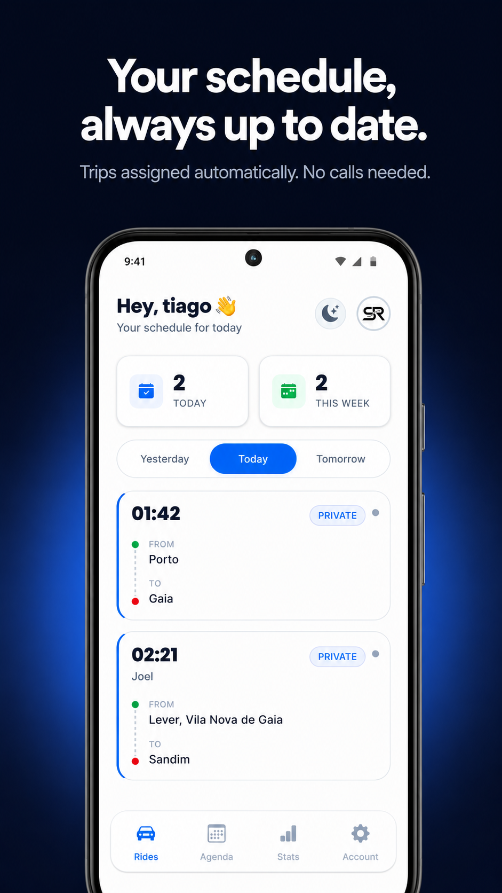
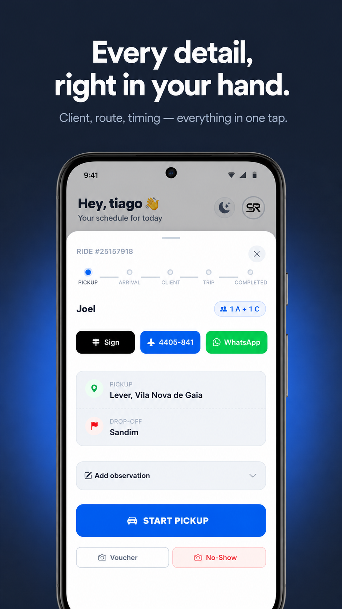
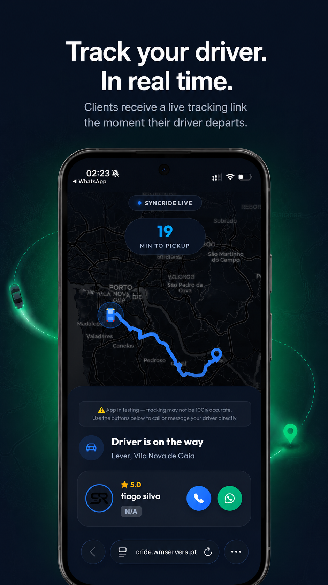
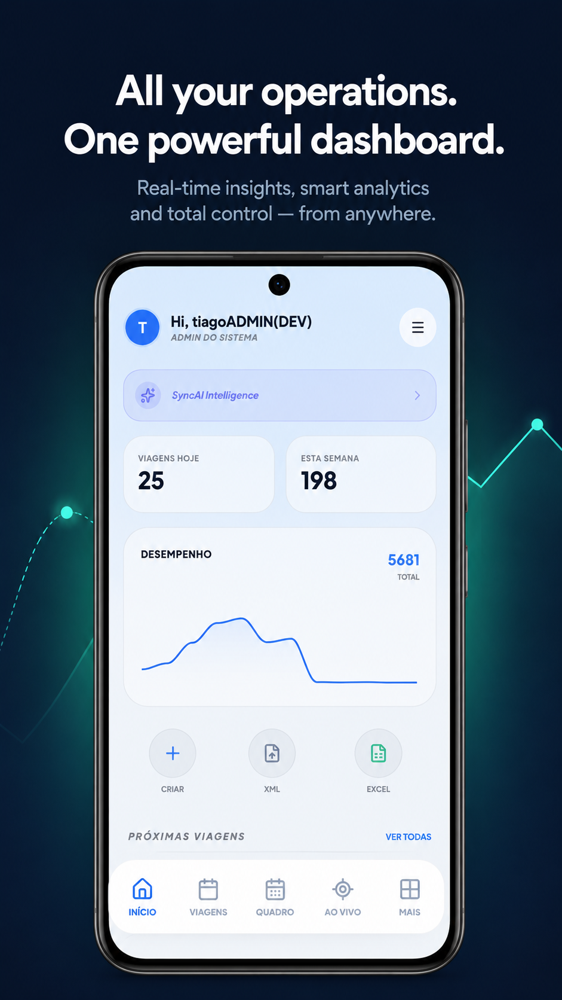
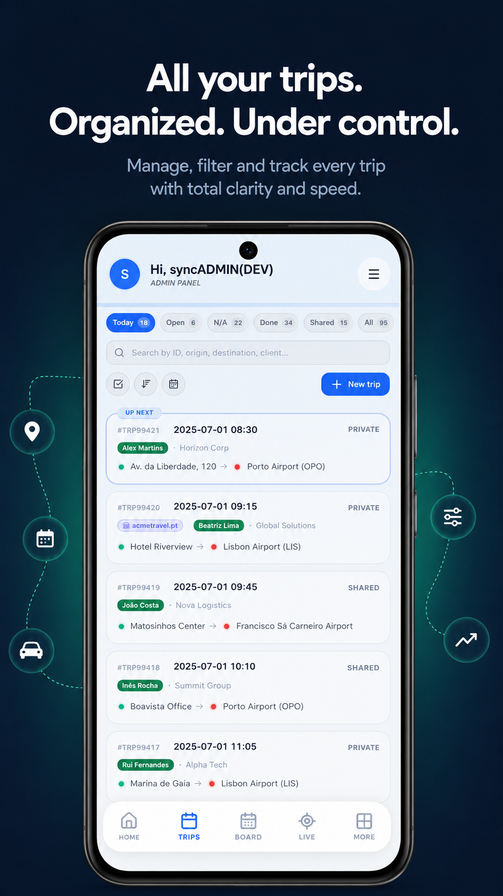

# SyncRide

[](https://github.com/1231366/SyncRide/actions/workflows/ci.yml)
[](https://www.php.net/)
[](https://www.php-fig.org/psr/psr-4/)
[](https://phpunit.de/)
[]()


> **Fleet and transfer management, end-to-end.** Schedules reach drivers automatically, clients track their ride in real time, and invoices generate without anyone touching a spreadsheet.

SyncRide is a **production SaaS** managing transfer companies from end to end — trips, drivers, fleet, partners, and automations. Three experiences, one system: the **Admin back-office** on desktop, the **Driver App** on mobile (Android), and the **Partner Portal** for agencies and hostels.

---

## 📱 Android App — now on Google Play

<p align="center">
  
  &nbsp;
  
  &nbsp;
  
</p>

The driver app streams GPS in the background (native Java via Capacitor) so tracking keeps working even when Waze is open. Clients receive a live tracking link the moment their driver departs — showing ETA, route, and driver info in real time.

---

## 🖥️ Admin Back-office

<p align="center">
  
  &nbsp;
  
</p>

Full operations dashboard: trip management, driver assignment, live fleet map, Excel import, financial reports, and schedule board — all in one place.

---

## ✨ What it solves

- **Automatic dispatch** — schedules go to drivers via WhatsApp every morning, zero manual work
- **Real-time GPS tracking** — background location (native Java), heading-aware map marker, sub-5s updates
- **Firebase push notifications** — ride reminders 30 min before departure, even when the app is closed
- **Multi-company** — same driver works for multiple companies, schedule separated per company
- **Partner portal** — agencies and hostels request transfers and track status without calling
- **No-show proof** — photo + GPS stored and emailed automatically
- **Excel import** — bulk import from PRtours/operator Excel files with pricing engine
- **Stripe billing** — 7-day free trial, self-service registration, subscription management

---

## 🛠️ Architecture

<details>
<summary>Stack & decisions</summary>

- **PHP 8.2**, no framework — custom MVC (thin Controllers → Repositories → Services)
- **PSR-4** autoload, **PDO** with prepared statements everywhere
- **Multi-tenant** — every query scoped by `company_id`; isolation is a compile-time concern
- **Hybrid Android** — Capacitor WebView + native Java for GPS and FCM (one codebase, no separate native app)
- **WAF-resilient API** — POST bodies base64-shielded (`wafBody`) to bypass mod_security on shared hosting
- **Long-polling tracking** — 4s interval, sub-5s latency, zero extra infrastructure vs WebSockets
- **Security** — CSRF tokens, ownership guards on all mutations, `bcrypt`, `session_regenerate_id`, output escaping
- **CI** — GitHub Actions: PHP syntax lint + PHPUnit on PHP 8.2 and 8.3

```
app/          Controllers, Repositories, Services, Models
cron/         Scheduled jobs (reminders, WhatsApp dispatch)
public/       Entry points + assets (only web-accessible folder)
resources/    Views (PHP templates) + PT/EN translations
tests/        PHPUnit unit tests
```

**Run locally:**
```bash
composer install
cp .env.example .env   # configure DB + mail + Stripe
php -S localhost:8000 -t public
composer test
```

</details>

---

**Author:** Tiago Silva · [tiagofsilva04@gmail.com](mailto:tiagofsilva04@gmail.com) · [github.com/1231366/SyncRide](https://github.com/1231366/SyncRide)
